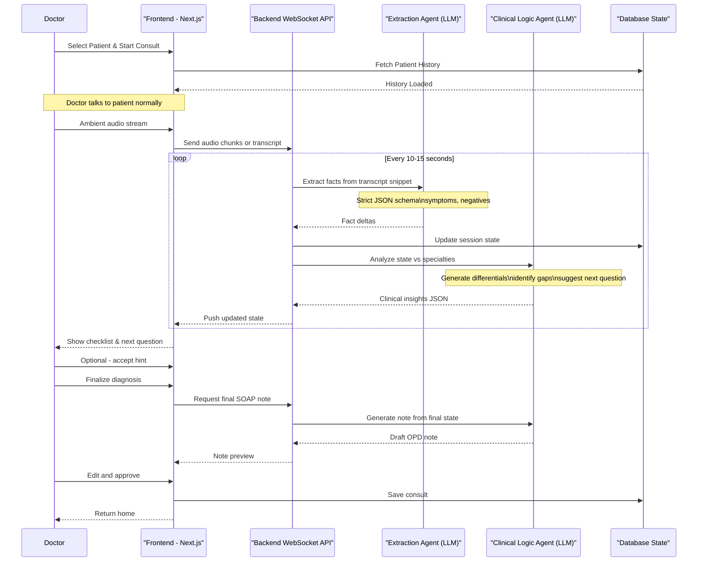

# MALI OPD: Architecture, LLM Strategy, and Scaling Flow

Based on the `PROJECT_PLAN.md` and current frontend state, this document outlines the missing UI flows, LLM logic feasibility (specifically structuring output), and the technical architecture scaling from Mock to Production.

## 1. Frontend Flow Analysis (Current vs. Planned)

After reviewing `apps/web/src/app`, the following pages are currently mapped:

- ✅ **0. Entry Point:** `/page.tsx`
- ✅ **1. Live Consultation:** `/consultation/session-active/page.tsx`
- ✅ **4. Differential Diagnosis:** `/consultation/session-active/diagnosis`
- ✅ **7. Auto-Generated Note:** `/consultation/session-active/note`
- ✅ **8. Session End:** `/consultation/session-active/summary`

### ❌ Missing Flows on Frontend:

- **2. Question Checklist & 3. Real-Time AI Suggestions:** Needs to be integrated as a side panel in the active session view (`/consultation/session-active`).
- **5. Gap & Uncertainty Awareness ("What's Missing?"):** Needs to be a widget or an overlay closely tied to the Differential Diagnosis view.
- **6. 5-Minute Diagnosis Completion:** A dedicated confirmation flow bridge between the active session and the final note generation.

---

## 2. LLM Structured Output: Feasibility & Adjustments

The core engine relies on extracting symptoms, mapping to a checklist, and identifying missing information.
Using **LLM Structured Outputs (via OpenRouter)** is highly feasible but requires a deliberate architecture to be real-time and scalable.

### Schema Feasibility Adjustments:

1. **Avoid Monolithic Prompts:** Do not use one single LLM call to extract symptoms, deduce differentials, AND suggest the next question. It will be too slow for an active consultation and prone to hallucination.
2. **State Machine / Delta Updates:** Instead of re-processing the entire transcript every 10 seconds, the LLM should receive `[Current State + New Transcript Snippet]` and output only the `[State Deltas]`.
3. **Structured outputs (JSON Schema):** OpenRouter models (like `gpt-4o` or `claude-3-5-sonnet`) enforce JSON schemas. We should enforce strict schemas for:
   - `ExtractedFacts` (Symptom, Duration, Pos/Neg)
   - `ChecklistStatus` (Covered, Missing)

---

## 3. Mermaid System Flow (User Journey + LLM Logic)

The diagram below maps the user journey to the backend LLM processing logic, designed to scale and provide real-time feedback with minimal cognitive load on the doctor.

### Deep Dive: Practical LLM Logic for Symptom Classification

To make this scale:

1. **The Extraction Agent:** A fast model (e.g. `gpt-4o-mini` or `gemini-1.5-flash`). Its only job is Named Entity Recognition (NER) for medical terms. It converts "the pain started 3 days ago and it burns" into `[{"symptom": "pain", "characteristic": "burning", "duration": "3 days", "status": "positive"}]`.
2. **The Clinical Logic Agent:** A high-reasoning model (e.g. `claude-3-5-sonnet` or `gpt-4o`). It takes the structured facts from the Extractor + the Patient History and maps them against medical checklists. It outputs:
   - Differentials with confidence `%`.
   - The immediate "Next Best Question".

---

## 4. Scaling: Mock -> POC -> Production Stacks

To transition from the current setup to a scalable SaaS product, the stack must evolve:

### Phase 1: MOCK (Current State)

- **Goal:** UI/UX testing, investor demo.
- **Frontend/Backend:** Next.js (React) unified app.
- **State:** Zustand (in-memory state).
- **LLM/AI:** Hardcoded `setTimeout` fake responses or simple single-call generation on button click.
- **Data:** Local JSON mock arrays.

### Phase 2: POC (Development / Beta)

- **Goal:** Real integration with doctors, testing LLM latency and accuracy.
- **Frontend:** Next.js.
- **Backend:** Next.js Serverless API Routes (e.g. `/api/consultation/process`).
- **AI/LLM:** OpenRouter API (using `gpt-4o` for schema enforcement).
  - *Audio:* Web Speech API (browser side) sending transcript text chunks to the Next.js API.
- **Database:** Supabase (PostgreSQL) + Prisma/Drizzle ORM for persisting sessions.
- **Limitation here:** Vercel serverless functions might timeout or drop connections for long-running streaming. Good for testing, bad for 500 concurrent doctors.

### Phase 3: PRODUCTION Scale (Enterprise SaaS)

- **Goal:** Low-latency, high-concurrency, HIPAA-compliant, robust edge case handling.
- **Frontend:** Next.js + WebRTC (for direct audio-to-server streaming).
- **Backend (API/Live):** Dedicated Node.js or Go server using **WebSockets** or **gRPC / SSE**. Required for keeping persistent connections open during 15-minute consultations.
- **Worker Queue:** Redis / Kafka to queue transcription and LLM fact extraction tasks without blocking the main socket server.
- **AI/LLM Engine:**
  - **Transcription:** Dedicated Whisper ASR (hosted GPU cluster like Modal/Replicate) or Deepgram (low-latency streaming API).
  - **LLM Router:** An agentic framework (LangChain/LlamaIndex) calling OpenRouter. Splitting tasks into *Extraction* (fast model) and *Clinical Reasoning* (heavy model).
- **Database:** PostgreSQL (primary records) + Vector Database (Pinecone/Milvus) for RAG on patient history and hospital protocols.

---

### Conclusion & Next Steps

The `PROJECT_PLAN.md` is well thought-out regarding the *Doctor Experience*.
To make it real:

1. Implement the **Clinical Coverage Panel** UI component on the right side of `/session-active`.
2. Move from "Mock" to "POC" by integrating the Web Speech API (browser transcription) and setting up a Next.js Server Action to call OpenRouter using a structured JSON schema.
